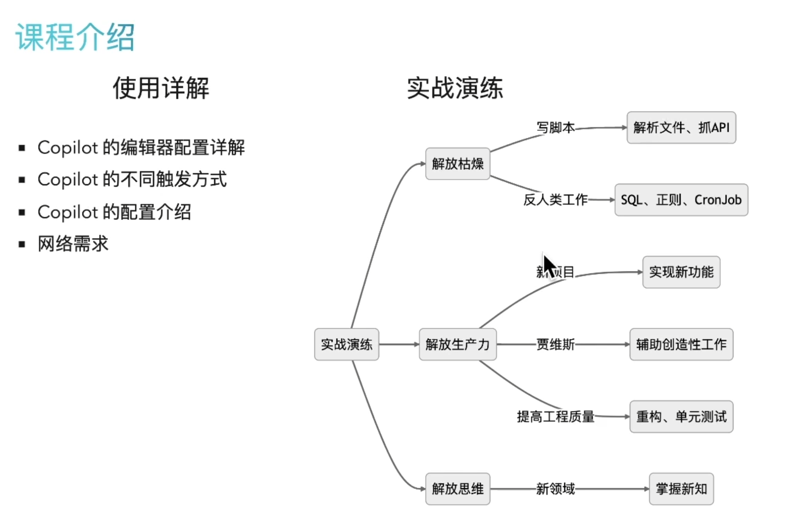

# Copilot是什么？

 

Copilot是一个基于OpenAI的AI代码生成工具，它可以根据你的代码需求，自动生成代码。可以帮助开发者在编程代码时提供代码建议，提高开发效率。

- Transformer
- 超大规模预训练模型
- GPT-3
- Prompt Engineering
- Prompt Everywhere

人们希望爱任何输入文字的界面都能得到智能的提示，而Copilot就是这样的一个工具。

slide copilot辅助我们写文章

# Copilot是怎么工作的？

 

Copilot来自于OpenAI的Codex，是一个基于GPT-3的代码生成模型。

- 从公共领域学习
 - 从GitHub上学习代码，理解主流编程语言的语法和语义，常见的编程模式。
 - 提示代码片段。
- 理解上下文
 - Copilot会学习当前项目代码，参考本地和公共领域的代码，理解上下文。
 - 提示包含全新、自定义的语言（DSL）、API、本地独占库的代码。

 - 自然语言
  - Copilot可以理解自然语言，你可以使用自然语言来描述你的需求，Copilot会自动生成代码。
  - 根据文字、注释、类或者函数命名，生成代码、文字。

# 为什么我们需要Copilot？

 

效率是开发者的核心需求，Copilot可以指数级地提升开发者的效率。

- 解放枯燥、重复劳动
    - 无痛、顺畅编写一次性的脚本编写、增删改查业务代码、单元测试。
- 新领域的学习与探索
    - 用新的语言、框架、库，快速上手。
    - 用新的技术，快速实现原型。
- 机器的优势
    - 机械性、繁琐的任务：SQL/Cypher/RegularExpression/CronJob。

# 课程介绍

