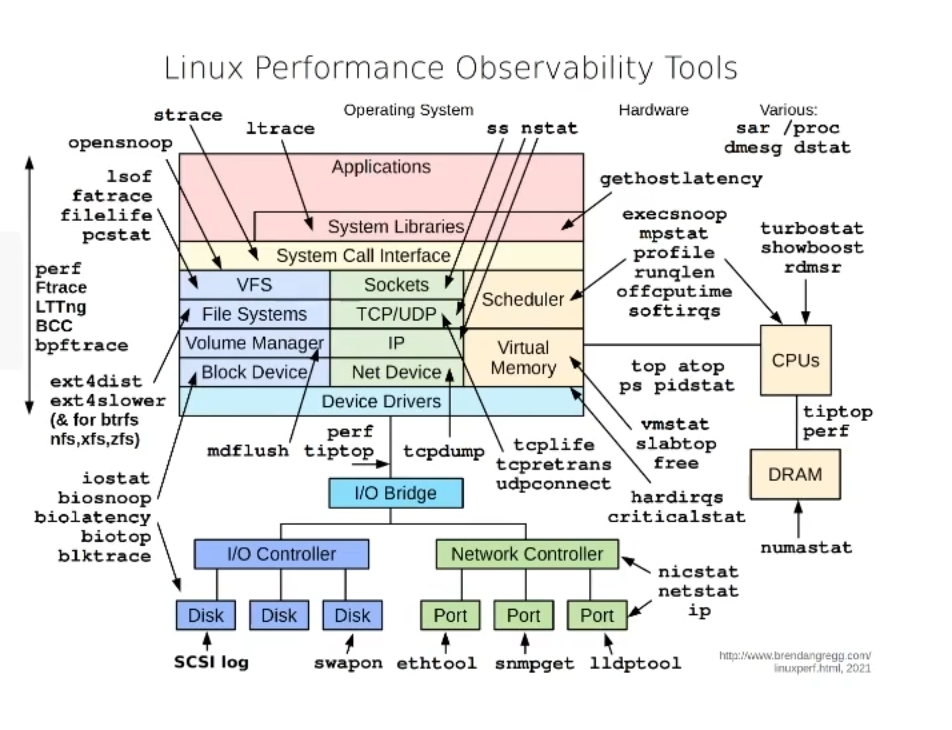
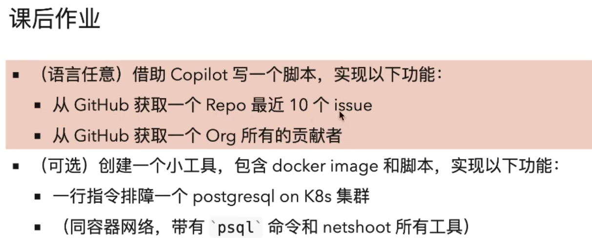

# GitHub Copilot实践课

## Outline

- 一个解析、改写配置文件的脚本
- 写一行`kubectl`命令
- shell解析json
- 获取GitHuub Repo的贡献者列表
- 写一个工具`Dockerfile`
- 课后做作业

### 一个解析、改写配置文件的脚本
---

输入：
https://github.com/vesoft-inc/nebula-algorithm/blob/master/nebulaalgorithm/src/main/resources/application.conf

需求：
- 读取配置文件
- 改写配置文件中的一些字段、方便脚本（DAG）自动调用

输出：
- 一个新的配置文件


- HOCON 一种JSON文件的变种
    - python `pip install hocon`


### 写一行`kubectl`命令
---

需求：获得pod列表，按照重启次数排序


### shell解析json

---

数据

```json
{
  "app": {
    "name": "MyApp",
    "version": "1.0.0",
    "features": {
      "feature1": {
        "enabled": true,
        "description": "This is feature 1"
      },
      "feature2": {
        "enabled": false,
        "description": "This is feature 2"
      }
    }
  },
  "database": {
    "url": "jdbc:mysql://localhost:3306/mydb",
    "user": "dbuser",
    "password": "dbpassword"
  },
  "server": {
    "host": "localhost",
    "port": 8080
  }
}
```


需求：获取zip字段


### 获取GitHub Repo的贡献者列表

---

需求：获取NebulaGraph的贡献者列表


github.com/vesoft-inc/nebula-graph

### 写一个工具`Dockerfile`

---

方便连接容器部署的数据库集群排障

```shell
docker run -it \
    --net container:<conntainer_name> \
    nicolaka/netshoot
```

ref:

- https://github.com/nicolaka/netshoot
- https://github.com/vesoft-inc/nebula-console/
- https://hub.docker.com/r/vesoft/nebula-console



